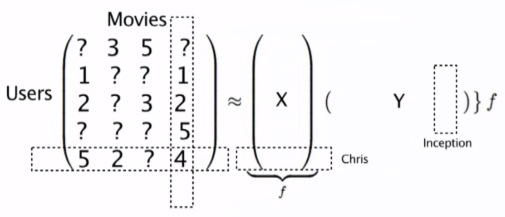

```{r setup, include=FALSE}
knitr::opts_chunk$set(echo = TRUE)
```

```{r}
library(kableExtra)
```


#Music Recommendations at Scale with Spark

Spotify uses a methodology to recommend songs to its listeners which defers from the methods studies in class in two aspects:
- Data is implicit
- The recommendation has been stated as an optimization problem

#Explicit and Implicit data

At a high level, Spotify’s cases might seem similar to those already looked at in class around movie recommendation. For these recommenders we built matrices with each combination of users and the movies they have rated. To obtain this data users have to proactively rate movies on say a scale of 1 to 5. Because users are providing the rating, this is know as explicit data. The matrix below is show as an example of this type of data.


The MovieLens dataset is a good of this kind of data.

```{r}
data <- read.csv("movieLens.csv", header = FALSE)[1:40,]
colnames(data)<-c('user_id','item_id','rating','timestamp')
data %>% kable() %>% kable_styling() %>% scroll_box(width = "800px", height = "400px")
```

From this data we can build the matrix. The matrix will have all the users and the ratings given by then to certain movies. But Spotify doesn't ask its users to rate movies. Instead it tracks what songs have a user listened to. So the matrix is composed of zeros and ones denoting when the user hasn't and has listened to a particular song.


But if we try to use any of the techniques already studies, such as collaborative filtering, we wouldn't be able to account for the number of times a users listened to a song, which would really account for the rating for that song. If a user listens to a song many times, that is equivalent to it having a high rating. FOr this reason Spotify has propossed a different approach to recommendations.

#Optimization problem

In contrast with many machine learning techniques such as linear regression, logistic regresion, neural networks, recommendation algorithm have not been optimization problems. In lineal regression for example, we are looking at minimizing a the error between a line and our data, not the case in recommenders so far. But what of we stated it this way? This is what Spotify has done.

What they have done is represented the original matrix as the product of two lower order vectors, one for users, the other for songs.


Now that we have approximated the matrix to a user vector and a songs vector, the task at hand is to find what vectors best approximate the matrix. To be clear, the same statement can be made for the explicit data with ratings. 



So what is left is to determine a way to find these vectors. To do this an error function if defined to quantify the difference between any given vectors and the matrix. To find the vectors, this error has to be minimized. 


This is similar to many ML techniques. But as in such techniques, regilarization is added to avoid overfitting


Andrew Ng's machine learning is almost a classic and explains how to handle regularization very well: https://www.youtube.com/playlist?list=PLLssT5z_DsK-h9vYZkQkYNWcItqhlRJLN

But stated as is, if the original matrix is 0 and 1's, we would be missing the rating given by the number of times a user listens to a song. For this reason they added a weight.


##Alternating least squares

So how do they calculate both vectors. It turns our they almost use brute force to do this. Basically they fix a vector, one of the two, they solve the least squares regression and calculate the other vector. Then the resulting vector is fixed and the first vector is calculated again solving the regression problem. This is done back and fourth until a minimum is found.

The presenter show how this was done first using Hadoop and then moving into Spark. The biggest difference here was moving from a disk based system, Hadoop, to one in memory, Spark, where data can be placed in a cache. The presenter doesn't go into details, but the minimum can be found with techniques such as gradient decent.


